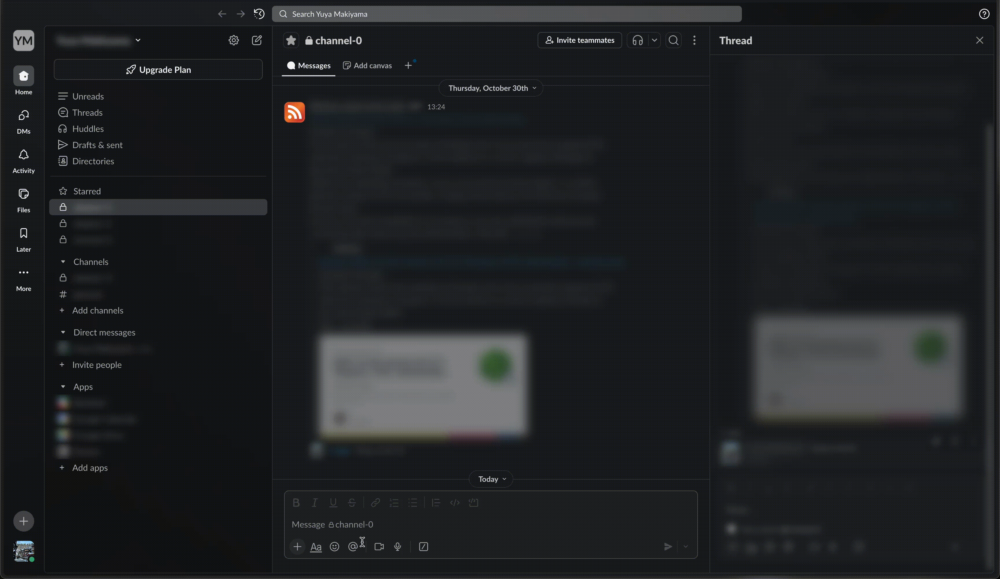
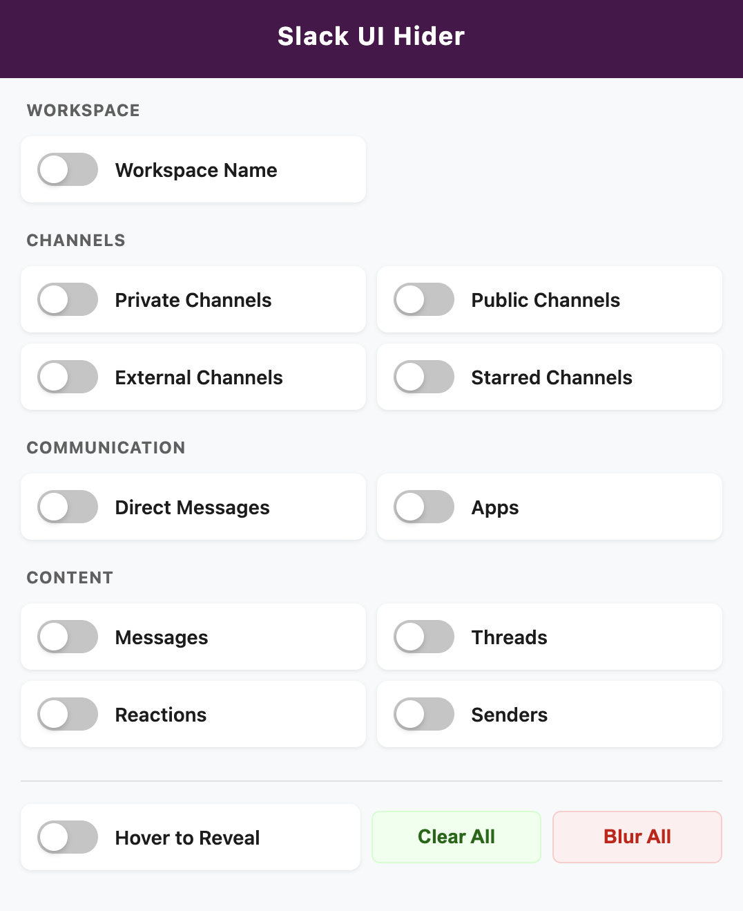

# Slack UI Hider

A Chrome extension that blurs UI elements in Slack to protect sensitive information during screen sharing or recordings.

## Installation

Install the extension from [Here](https://chromewebstore.google.com/detail/slack-ui-hider/pglopipbgnkkoapmbkcdakpcggafapdm)

## Usage

1. **Open the Extension Settings**: Click the extension **icon** in your Chrome toolbar while on any Slack workspace page

   

2. **Toggle Elements to Blur**: Use the toggle switches to select which UI elements you want to blur:
   - Changes are applied immediately to all open Slack tabs
   - Your preferences are saved automatically

3. **Hover to Reveal** : Enable the "Hover to Reveal" option at the bottom of the settings to temporarily reveal blurred content when you hover over it

4. **Quick Blur All**: Use the "Blur All" button to quickly enable all blur options at once

5. **Reset**: Use the "Clear All" button to disable all blur options
